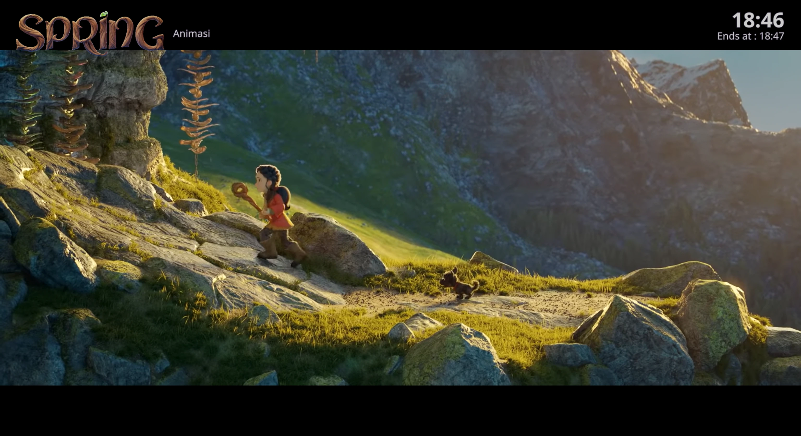
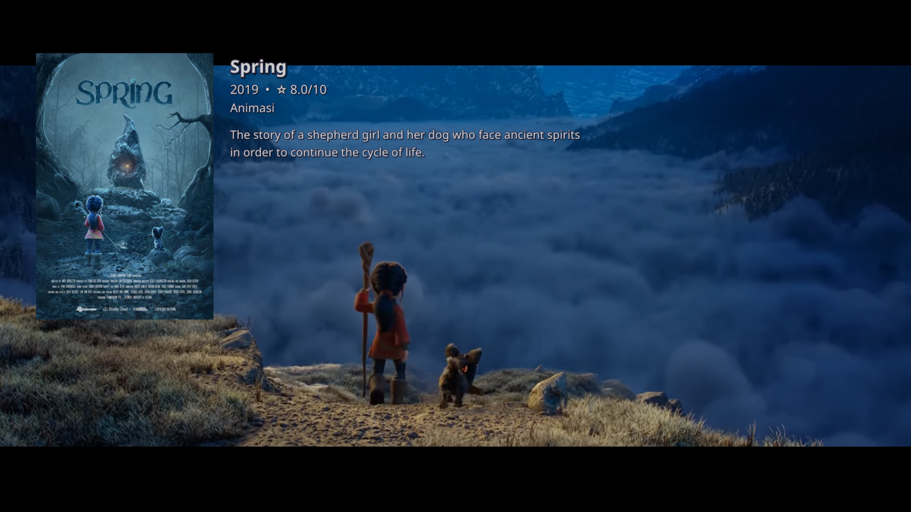

# mirip-kodi (Media Library Scanner & MPV OSD Overlay)

This project is an integrated Kodi-style media library automation system consisting of two main components:

1. **`scan_movies`**: An automated Python-based script to scan movie/TV series directories and download metadata and images from TMDB.
2. **`movie-info.lua`**: A Lua script for the MPV video player that reads the scanned metadata and displays it as an interactive info interface (poster, synopsis, genres, and a digital clock).

## Key Features

* **Automated Scanning**: Recursively reads Movie and TV Series folders.
* **TMDB Integration**: Automatically downloads information and synopses in Indonesian (`id-ID`).
* **Asset Cleaner**: Downloads movie posters as well as compresses and sharpens clear logos (`clearlogo.png`) using Pillow.
* **Kodi-Style MPV Interface**: Displays an overlay featuring posters, ratings, genre lists, cleanly wrapped synopses, a real-time clock, and estimated completion time.
* **Smart Visibility**: Information automatically appears when a video is paused or the mouse cursor moves, and automatically hides when playback resumes.

## System Requirements

Before starting the installation, ensure your Linux system meets the following requirements:

* **Operating System**: Linux / Unix-based (The script reads external media directory paths like `/run/media/...`).
* **Python**: Version 3.x or latest.
* **Player Application**: [MPV Player](https://mpv.io) installed on your system.
* **Supporting Tools**: `ffmpeg` and `ffprobe` (Default in Linux systems; required by the MPV script to process images).

### Python Dependencies

The scanner script requires the third-party **Pillow** library for image processing. Install it via terminal:

```bash
pip install Pillow

```

## Environment Configuration (.bashrc)

This script requires TMDB API authentication to function. It is recommended to use a **TMDB Read Access Token (v4 auth)** added to your `.bashrc` file.

### How to Get a Free TMDB Token:

1. Open the official [The Movie Database (TMDB)](https://themoviedb.org) site and log in.
2. Click your profile icon in the top right corner and select **Settings**.
3. In the left menu, click the **API** tab.
4. Click the **Create** link under the "Request an API Key" section, then choose the **Developer** application type.
5. Fill out the application information form (you can set the project name to `mirip-kodi` and the URL to your GitHub repository).
6. After accepting the terms, find the **API Read Access Token (v4 auth)** section containing a long text code and copy it.

### Adding the Token to Your System:

Run the following commands in your terminal to automatically append the token to your Linux environment configuration:

```bash
# Add TMDB Token to .bashrc
echo 'export TMDB_TOKEN="your_v4_read_access_token_here"' >> ~/.bashrc

# Reload terminal configuration for immediate effect
source ~/.bashrc

```

*Note: Make sure to replace `"your_v4_read_access_token_here"` with the long token code you copied from the TMDB dashboard before pressing Enter.*

## Component Installation Steps

Follow these installation steps in your terminal to set up the global scanner and MPV player side by side:

### 1. Clone the Repository

```bash
git clone https://github.com/thecimot/mirip-kodi
cd mirip-kodi

```

### 2. Install Media Scanner (`scan_movies`) Globally

To execute the script directly from anywhere in the terminal without typing the `.py` extension:

```bash
# Create local bin directory if it doesn't exist
mkdir -p ~/.local/bin

# Copy the main scanner file
cp scan_movies ~/.local/bin/

# Grant executable permission to the file
chmod +x ~/.local/bin/scan_movies

```

*Ensure that `~/.local/bin` is added to your system `$PATH` variable inside `.bashrc`.*

## 3. Customize Script Settings (`scan_movies`)

You can customize media target folders and the primary search language directly inside the `scan_movies` script. Open the file with your editor of choice (e.g., Nano):

```bash
nano ~/.local/bin/scan_movies

```

Find the configuration code block near the top of the file and adjust the parameters:

### a. Setting Target Media Folders

Modify the paths inside `Path("...")` to match your Movie and TV Series folder locations on your hard drive/external storage:

```python
# ============================================================
# DIRECTORY CONFIGURATION
# ============================================================

MOVIES_DIR = Path("/run/media/cimot/cimot/MOVIES")
TV_DIR = Path("/run/media/cimot/cimot/TV SERIES")

```

### b. Changing Language Preferences

By default, the script prioritizes Indonesian synopses. If metadata is unavailable, it automatically falls back to English. You can change the standard ISO 639-1 language code if needed:

```python
PRIMARY_LANGUAGE = "id-ID"      # Primary metadata search language (Indonesian)
FALLBACK_LANGUAGE = "en-US"     # Fallback language if primary is missing (English)

```

After making edits, save changes by pressing `Ctrl + O`, hit `Enter`, and press `Ctrl + X` to exit Nano.

### 4. Install MPV Interface (`movie-info.lua`)

Copy the Lua script directly into MPV's default configuration directory:

```bash
# Create MPV scripts directory if it doesn't exist
mkdir -p ~/.config/mpv/scripts

# Copy the OSD interface script
cp movie-info.lua ~/.config/mpv/scripts/

```

## 5. Usage Instructions

### Scanning Media Files

Open your terminal and run the following global command to automatically update all image assets and JSON metadata:

```bash
scan_movies

```

### 6. Displaying Info in MPV

Play your movie or TV series using MPV. The smart info interface appears automatically when moving the mouse or pausing playback. To bring up the full info panel (Poster and Synopsis), press:

* **`=`** (Equal sign) key
* **Right-Click** inside the MPV window

### 7. Screenshots

a. Clear Logo, Genre, and Clock appear when the mouse moves and fade out automatically. Default duration = 10 seconds.


b. Poster, Rating, and Synopsis appear on Right-Click and toggle off with a second Right-Click.


### 8. Example Media Folder Included

The repository includes an example movie folder complete with metadata and posters so you can test if `movie-info.lua` works with your MPV Player right away.

### HAPPY WATCHING!!

## License

This project is licensed under the **MIT License** - See the code files for copyright details by Hartono (2026).
